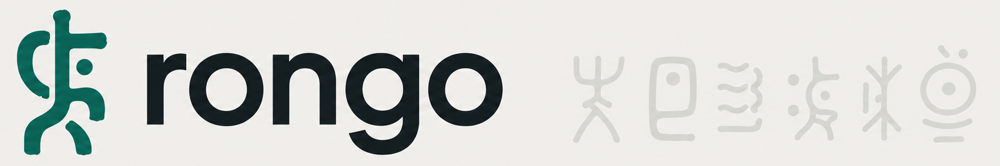

Codeverstehen ohne Umweg über eine Person. rongo indexiert die Repositories einer Organisation,
klärt bei mehrdeutigen Fragen zurück, welcher Mechanismus gemeint ist, und erklärt ihn in der
gewählten Rolle — **BA** fachlich, **DEV** technisch. Jede Aussage ist belegt.

Technische Entscheide: [`AGENTS.md`](AGENTS.md).

## Stand

Die Frage-Antwort-Strecke steht: Indexierung, Retrieval, Rückfrage bei
mehrdeutigen Fragen und belegte Antworten, gemessen in
[`docs/measurements/`](docs/measurements). Anmeldung läuft über OIDC
(`BACKEND_AUTH_MODE=oidc`), betrieben wird der Stack mit `compose.yaml` hinter
einem Reverse Proxy, der TLS terminiert.

## Voraussetzungen

- Go, Node.js
- `git`
- `rg` (ripgrep)
- `ctags` — **universal-ctags**, nicht die BSD-ctags, die macOS unter
  `/usr/bin/ctags` mitliefert. Installation: `brew install universal-ctags`,
  und sicherstellen, dass sie auf `PATH` vor `/usr/bin` steht.

## Entwicklung

```
cp .env.example .env   # BACKEND_SESSION_SECRET setzen, z. B. mit
                        # openssl rand -base64 32
make dev                # Backend + Vite-Devserver mit Hot Reload
```

`make dev` startet das Backend auf `127.0.0.1:8080` und Vite auf
`127.0.0.1:5173`; `/api/*` wird zum Backend durchgereicht.

Weitere Ziele: `make build` (Binary), `make test` (Go-Tests), `make fe-test`
(Typecheck + Frontend-Tests). Details zu manuellen Prüfungen:
[`docs/manual-verification.md`](docs/manual-verification.md).
