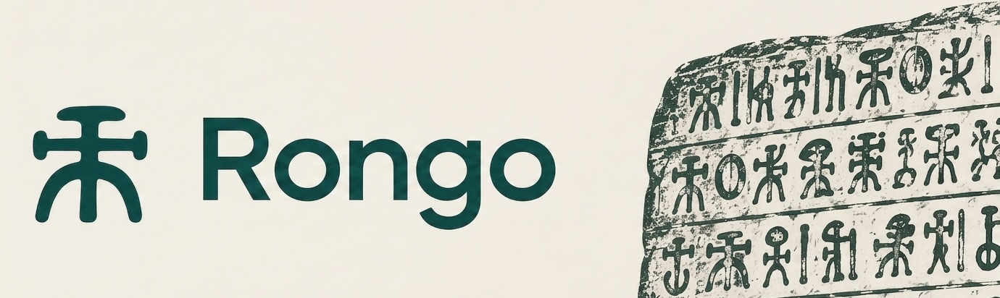

Turns a codebase into something the rest of the company can ask. Plain-language
questions, answers in domain terms, flowcharts and sequence diagrams where the
process is the point.

Rongo clones the repositories you list, indexes them, and answers questions about
them in a browser. No checkout, no terminal, no coding agent: the people who have
to know what the software does ask in their own words, and the answer comes back
in theirs. The name comes from Rongorongo, the Easter Island script that nobody
has deciphered.

## What a reader gets

**An answer, not a search result.** Ask why an order can be cancelled twice, or
what happens to a customer record on close, and Rongo reads the code that matched
and explains the mechanism.

**A diagram where the flow is the answer.** A process worth following step by step
comes back as a flowchart, an exchange between services as a sequence diagram.

**Somewhere to look.** Every claim shows where it was read, and one click opens
that file inside Rongo, at the state it was indexed at.

**A question back, when the question could mean several things.** Rongo asks which
product or which reading was meant instead of answering the wrong one, and when a
question spans more of the estate than one answer can carry, it asks which
repositories to narrow to.

**Your language.** A thread is answered in the language its first question was
asked in. German is Swiss German.

**A link to send on.** Any thread can be shared as a read-only page, frozen where
you shared it, and revoked later.

Developers can switch a thread to the Developer voice, which explains how the code
does it and shows the code inline.

## What it will not do

The index holds the code and docs as written, never summaries of them. Where docs
and code disagree, the answer says so and sides with the code. If the trail leads
into code that is not indexed, Rongo says the call and the configuration are
visible but the internals are not. If nothing matched, it says so and names the
terms it tried, rather than assembling an answer out of whatever was nearby.

## How it works

One Go binary, one SQLite file (FTS5 for text, sqlite-vec for embeddings), React UI
embedded in the binary. Symbols come from universal-ctags, search from ripgrep,
checkouts from git. Chat goes to an OpenAI-compatible endpoint serving the MiMo
deployments named in `backend/internal/llm/client.go`, embeddings to any
OpenAI-compatible `/embeddings` endpoint.

Repositories are listed in `repos.yaml`; credentials never are, they come from
`BACKEND_*` environment variables, one per forge host.

## Running it

`make dev` runs it locally with hot reload. Needs Go, Node.js, `git`, `rg` and
universal-ctags (the BSD ctags macOS ships doesn't work and Rongo says so at
startup).

`compose.yaml` runs it in production behind a TLS-terminating reverse proxy with
OIDC login, which is how the rest of the company gets in. The comment at the top of
that file covers the first run.

## Development

```
make test        # Go tests
make fe-test     # typecheck and frontend tests
make coverage    # both, with the 75% floor CI enforces
make build       # bin/rongo with the UI embedded
```

Design decisions and invariants: [`AGENTS.md`](AGENTS.md). The measurements behind
them: [`docs/measurements/`](docs/measurements). Checks that need a real browser:
[`docs/manual-verification.md`](docs/manual-verification.md).
